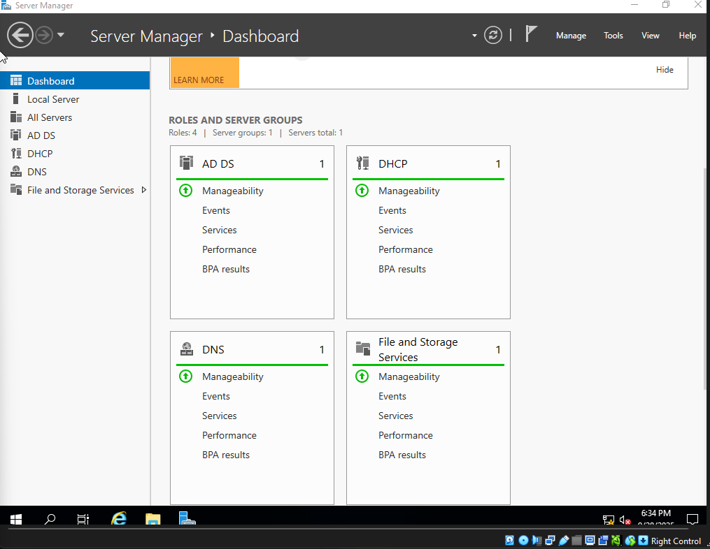
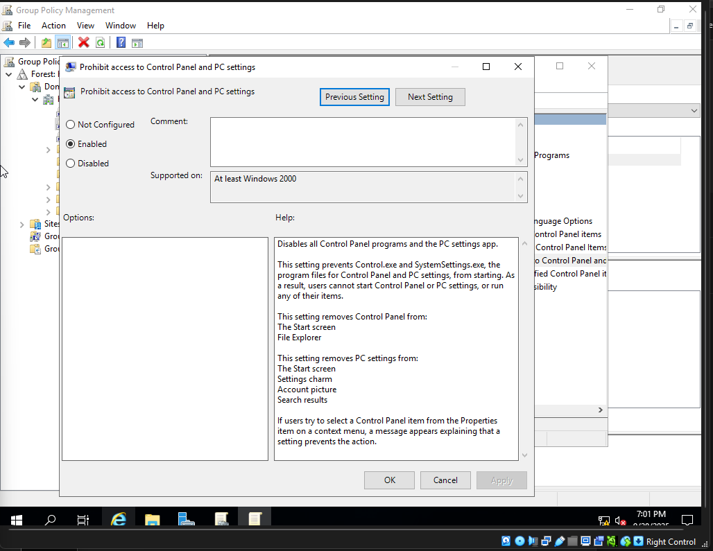
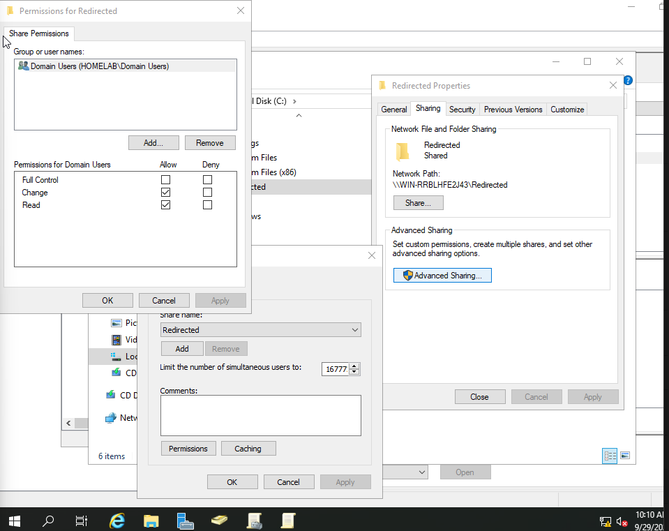

+---------------------------------------------------+
|                 Active Directory Lab              |
|                  (homelab.local)                  |
+---------------------------------------------------+

                  [ DC01 – Domain Controller ]
                  -----------------------------
                  • Windows Server 2019
                  • AD DS (Active Directory)
                  • DNS
                  • DHCP
                  • Static IP: 192.168.10.10
                  
                  
                  
                  
                  
		  
	          
		  
)

                          │
        -------------------------------------------------
        │                                               │

[ WS01 – Windows 10 Client ]                 [ (Future) WS02 – Another Client ]
-----------------------------                 -------------------------------
• Gets IP from DHCP (192.168.10.100–200)     • Would also get IP from DHCP
• DNS points to 192.168.10.10                • Same domain join process
• Joined to homelab.local                    • Optional extra workstation
• Logs in with domain user                   • For testing multiple clients
  (HOMELAB\testuser1)
• [DHCP Lease Screenshot](./screenshots/ws01-ipconfig.png)
• [Domain Join Screenshot](./screenshots/ws01-domain-joined.png)
• [Login Screenshot](./screenshots/ws01-login.png)
• [Wallpaper Applied](./screenshots/ws01-desktop-wallpaper.png)
