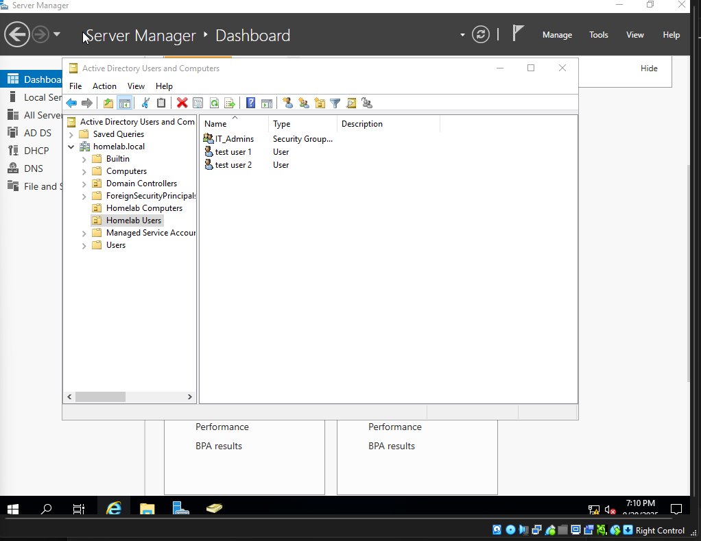
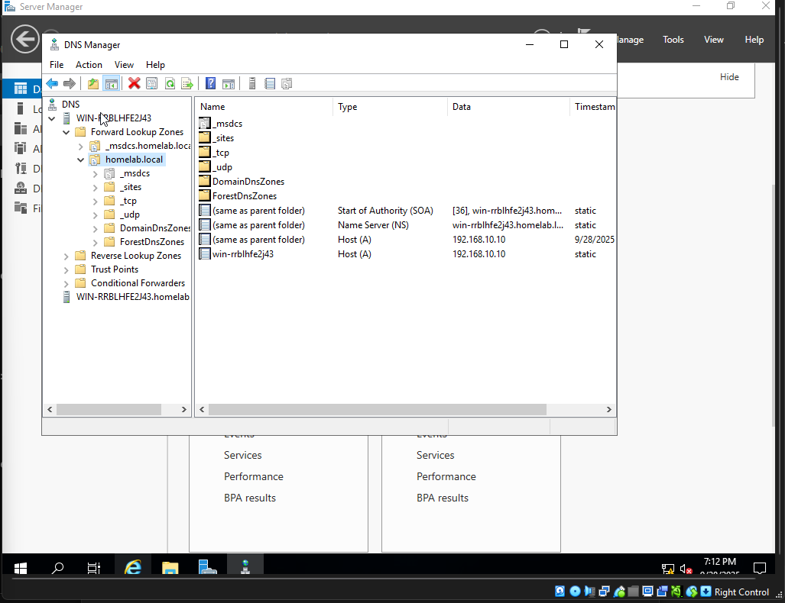
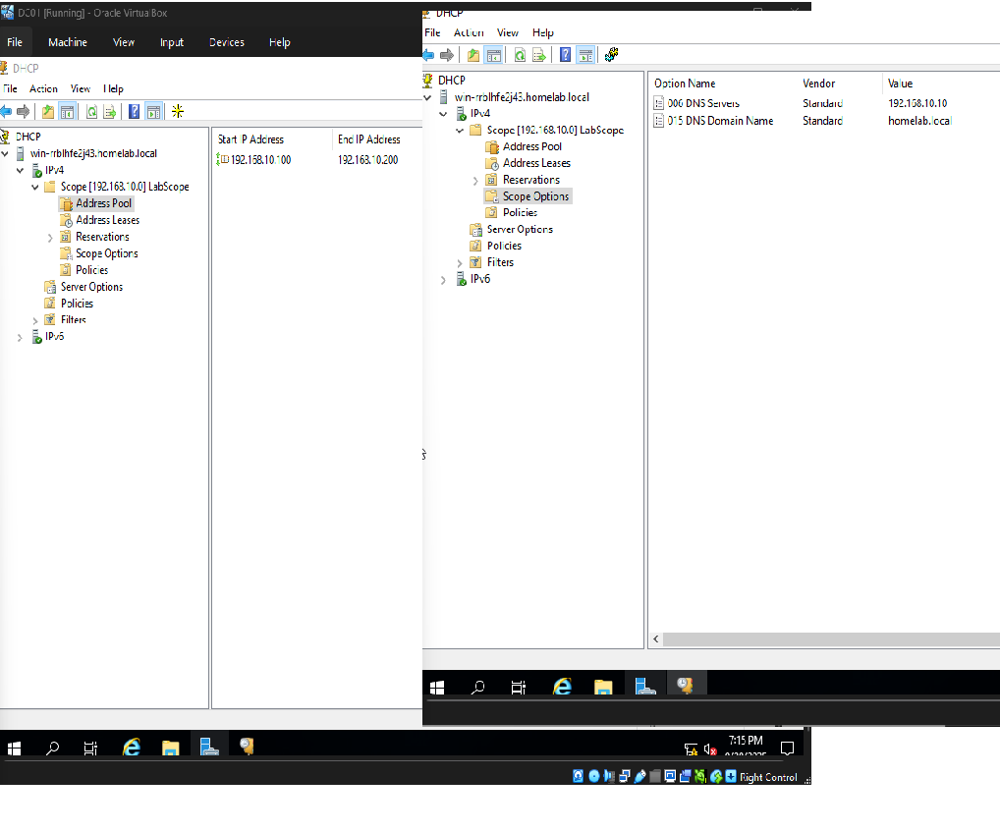
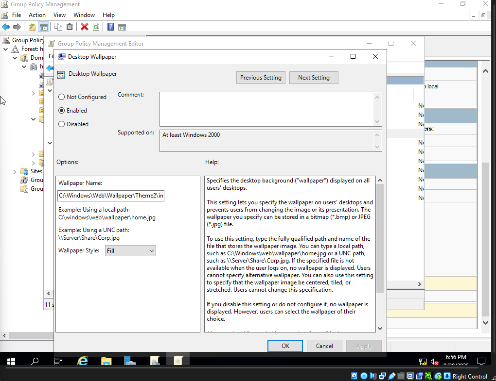
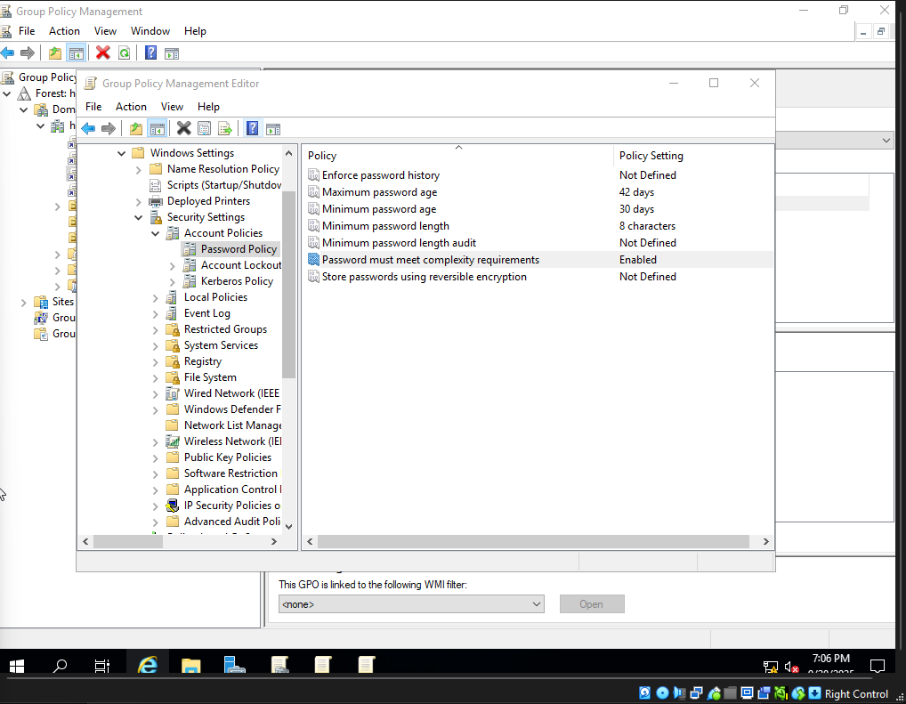
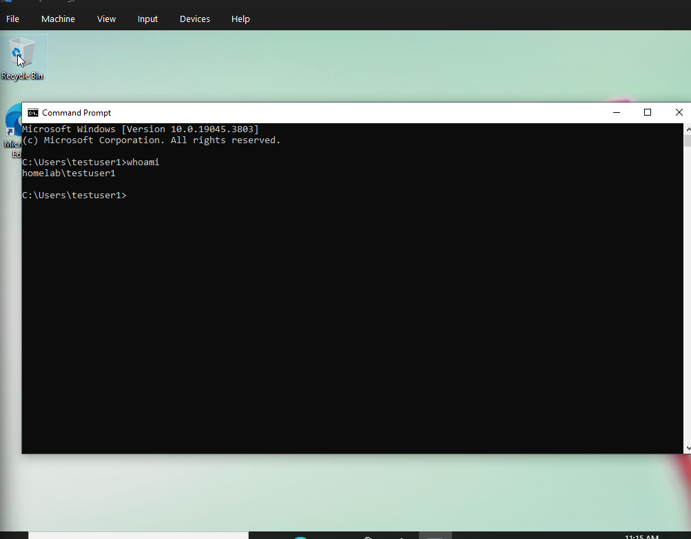

# Active Directory Home Lab

A home lab project exploring the basics of Active Directory, DNS, DHCP, and Group Policy.

---

## Domain Controller (DC01)
- **OS:** Windows Server 2019  
- **Roles:** AD DS, DNS, DHCP  
- **Domain:** `homelab.local`  
- **Static IP:** `192.168.10.10`  

### Screenshots
- [Server Manager – Roles](./screenshots/server-roles.png)
- 
- 
- 
- 
- 
- 
- 

---

## Client (WS01 – Windows 10)
- Obtains IP via DHCP (`192.168.10.100–200`)
- DNS points to `192.168.10.10`
- Joined to `homelab.local`
- Logs in with domain test accounts (e.g. `HOMELAB\testuser1`)

### Screenshots
- 
- 
- 
- 

---

## Features Demonstrated
- Active Directory forest/domain setup
- DNS configuration
- DHCP scope with router, DNS, and domain options
- Group Policy Objects:
  - Desktop wallpaper
  - Disable Control Panel
  - Enforce password complexity
  - Folder redirection
- Client domain join and login

---

## How to Reproduce
1. Install AD DS, DNS, and DHCP roles on Windows Server.  
2. Promote the server to a domain controller (`homelab.local`).  
3. Configure DNS zone and DHCP scope.  
4. Create OUs, users, and groups.  
5. Apply GPOs (wallpaper, restrictions, folder redirection).  
6. Join client machines (e.g., Windows 10) to the domain.  

---

## Repository Structure
